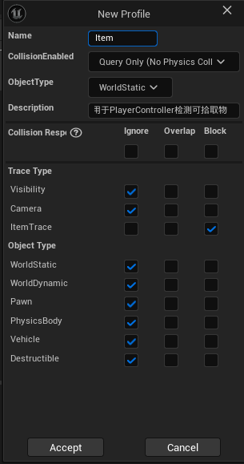
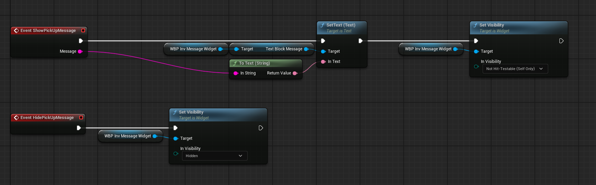
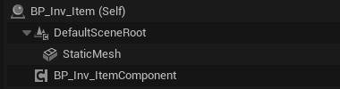
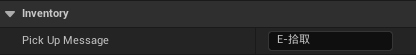
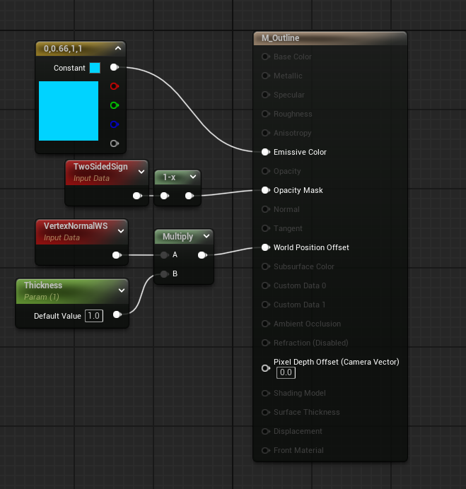
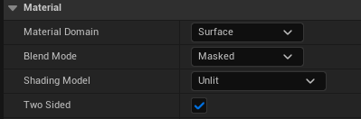

# 1. 实现射线检测道具、显示道具信息、高亮道具

## 1-9 为拾取物创建新的Trace Channel

### 步骤

1. 创建Trace Channel---ItemTrace，Default Response为Ignore

2. 创建新的Collision Preset

   

### 目的

避免射线检测时频繁判断Actor是否为可拾取物，直接使用ItemTrace过滤掉Ignore ItemTrace的Actor

## 1-10 测试射线检测Item

### 步骤

1. PlayerController中声明**TraceForItem()**函数
2. 获取屏幕中心坐标
3. 使用**UGameplayStatics::DeprojectScreenToWorld()**将屏幕坐标转换为世界坐标
4. 进行射线检测**GetWorld()->LineTraceSingleByChannel()**，记录上一帧检测的目标和这一帧检测的目标
5. 打印名字进行测试
6. 在**Tick()**中调用该函数

注：进行射线检测时的Channel，可以用**TEnumAsByte<ECollisionChannel>**设为成员变量，在蓝图中设置，保证准确性

## 1-11 显示物品拾取信息

### 步骤

1. 创建**UInv_ItemComponent**类，声明**Message**变量供蓝图编辑
2. **UInv_HUDWidget**声明两个BlueprintImplementableEvent函数用于显隐物品拾取信息控件
3. **TraceForItem()**中，当**CurrentActor**无效时，隐藏控件；当**CurrentActor**有效时，查找**CurrentActor**上的**UInv_ItemComponent**获取物品信息并显示控件
4. 蓝图中创建信息控件蓝图，并在**HUDWidget**中实现显隐控件函数
5. 创建**UInv_ItemComponent**的蓝图类，**Item**添加这个组件，编辑要显示的信息

 

 

## 1-12 高亮看向的道具

### 步骤

1. 实现高亮材质

 

 

2. 创建高亮接口**UInv_HighlightInterface**，声明高亮和取消高亮两个函数
3. 继承**UStaticMeshComponent**和**UInv_HighlightInterface**，创建组件**UInv_HighlightableStaticMeshComponent**，实现两个高亮函数
4. **PlayerController**的**TraceForItem**函数中高亮当前物体，取消高亮上一个物体
5. 更改新组件的碰撞预设
